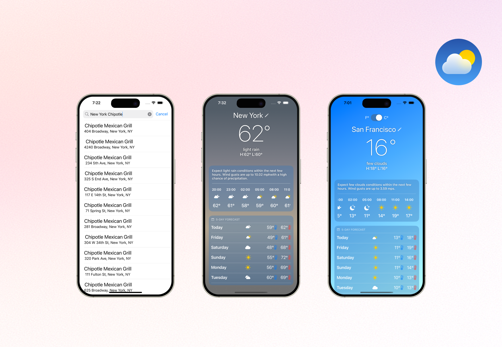

# WeatherNow

WeatherNow is an iOS weather application that delivers accurate, real-time forecasts for any location worldwide. Powered by the <a href="https://openweathermap.org/api" target="_blank" rel="noopener noreferrer"> OpenWeather API</a>, the app provides detailed hourly and daily weather outlooks based on user-selected locations.

  

Built with <a href="https://developer.apple.com/documentation/swiftui/" target="_blank" rel="noopener noreferrer">SwiftUI</a> and <a href="https://developer.apple.com/documentation/foundation/" target="_blank" rel="noopener noreferrer">Foundation</a>, WeatherNow offers a lightweight, minimalistic user experience modeled after Apple's native Weather app—with one key addition: a <a href="https://developer.apple.com/documentation/mapkit/" target="_blank" rel="noopener noreferrer">MapKit</a>-based location search. Users can enter any address worldwide and receive weather forecasts tied to the exact latitude and longitude—whether that’s their neighborhood or a favorite Chipotle spot. 🌮⛅